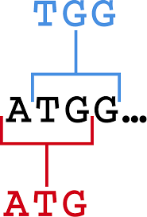
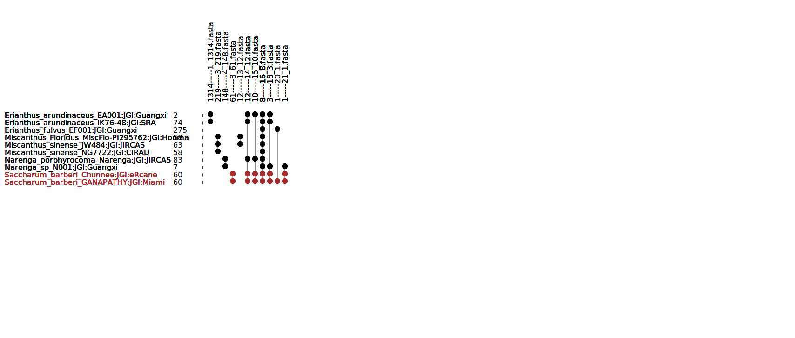
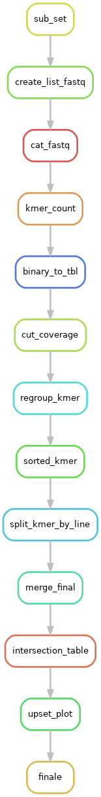

Today, get an assembly of large polyploid genome is very complicated and it's hard to compare lot of individuals of this polyploid species, in particular to compare sequences of many individuals.

Due to the daily deluge of data sequences the number of data increase and need to be analyse ...

So a huge question remains:

*"How can i compare many individuals of a speicies without assembly?"*

To that anguishing idea, we can answer: **KMER_WORFLOW can help you!**

KMER_WORKFLOW is is an open-source, scalable, modulable and traceable snakemake pipeline, able to compare multiple data short read (NGS) obtained from illumina sequencing by counting the number of shared kmers. The workflow KMER_WORKFLOW can help you to find which individuals share sequences informations to other.

KMER_WORKFLOW generates an upset plot (Graph) containing all information about how much kmer are shared by how much indivuduals and the sequences of them.

.. contents:: Table of Contents
   :depth: 1
   :backlinks: entry

Sub_Sampling reads Illumina and count KMERS
-----------------------------

The first step of KMER_WORKFLOW is to random sub sampling reads of all of individuals.
The pipeline will take the number of reads to sub sampling for each paired and merged the result. 

For example if you wante to sub sampling 10 Millions of reads of PAIRED data you need to precise 5 Millions of reads to sub sampling for each paired
However if you have single data you can make 10 Milions on the unpaired data. 

.. warning::
   * CONTAMINATION: BE CAREFUL MAKE SUR YOURS DATA DOESN'T CONTAINS CONTAMINATION MAYBE BEFORE LAUNCH PIPELINE USE TOOLS LIKE KRAKEN TO CHECK POSSIBLE CONTAMINATION.
   * NUMBER OF READS: MAKE SUR YOURS DATA CONTAINS ENOUGHT READS TO SUBSAMPLING. FOR EXEMPLE IF YOU HAVE _R1.fq.gz AND _R2.fq.gz AND YOU WANT SUB SAMPLING 10 MILLIONS MAKE SURE TO HAVE 5 MILLIONS IN BOTH.
   
.. note::
   * SEQTK: Seqtk is the tool use to subsampling data.

Included tools :

* Seqtk version >= 1.3-r106

Next the pipeline will count KMERS of each individuals

.. note::
   * KAT HIST: K-mer Analysis Toolkit to count Kmer and get binary output.
   * JELLYFISH DUMP: Provide count of kmer in human readable format. 
   
Included tools :

* kat version >= 2.4.2
* jellyfish version >= 2.3.0

Next the pipeline will make some steps to merge all information of count kmers of all individuals to make a final merged table of kmer count for each individuals

Theses steps use only bash command they are no included tools. 

.. warning::
   * MEMORY: MAKE SURE TO ADAPT NUMBER OF THREADS AND MEMORY PER CPU IN THE ``cluster_config.yaml`` FILE IF ONE OF THIS STEP FAILED 

Calculate intersection of KMERS between individuals
-----------------------------

When the merged table of kmer is created the pipeline will use this table to calculate intersection of KMERS over all individuals and provides an other table to make the kmer graph (upset plot)

You can change parameters of this script in the ``config.yaml`` file. 

.. note::
   * COUNT_INTERSECTION.PY: Is the custom python script which provides the table to make the upset plot

Included tools :

* python versions >= 3.8.2

UPSET PLOT , KMER intersection graph
-----------------------------

Last step of this pipeline is to make the upset plot 

.. note::
   * GRAPH_KMER_V3.PL: Is the custom perl script which make the final result of the pipeline : UPSET PLOT OF SHARED KMER BETWEEN ALL INDIVIDUALS
   
Included tools :

* perl versions >= 5.16.3

.. warning::
   Make sure to install the next perl library : 
   - GD::Simple
   - GD::SVG
   - Data::Dumper
   - Getopt::Long
   
Exemple of final graph of the pipeline : 

 
 The number next to the name of the individuals represents kmers only shared by himself (singleton). 
 Next to this number there is a barplot to have a representation of the quantity of singleton
 
 At the top of the graph we got one number which represent number of shared kmer for this columns and the XXX.fasta represents in which files are the sequences of shared KMERS

**Directed acyclic graphs (DAGs) show all step of the pipeline:**

