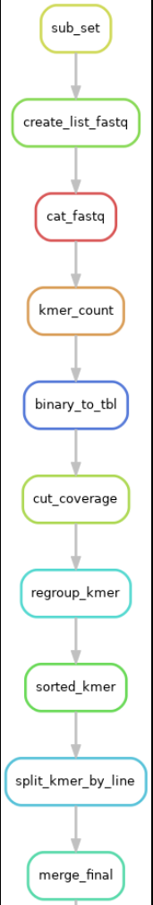

.. image:: _images/logo.png
   :target: _images/logo.png
   :align: center
   :alt: KMER Logo

Today, get an assembly of large polyploid genome is very complicated and it's hard to compare lot of individuals of this polyploid species, in particular to compare sequences of many individuals.

Due to the daily deluge of data sequences the number of data increase and need to be analyse ...

So a huge question remains:

*"How can i compare many individuals of a speicies without assembly?"*

To that anguishing idea, we can answer: **KMER_WORFLOW can help you!**

KMER_WORKFLOW is is an open-source, scalable, modulable and traceable snakemake pipeline, able to compare multiple data short read (NGS) obtained from illumina sequencing by counting the number of shared kmers. The workflow KMER_WORKFLOW can help you to find which individuals share sequences informations to other.

KMER_WORKFLOW generates an upset plot (Graph) containing all information about how much kmer are shared by how much indivuduals and the sequences of them.

.. contents:: Table of Contents
   :depth: 2
   :backlinks: entry

Sub_Sampling reads Illumina and count KMERS
-----------------------------

A variety of useful tools are implemented to check the accuracy of assemblies.

PodiumASM checks the quality of the assemblies with using these tools:

.. note::
   * BUSCO: helps to check if you have a good assembly, by searching the expected single-copy lineage-conserved orthologs in any newly sequenced genome from an appropriate phylogenetic clade.
   * QUAST: a good starting point to evaluate the quality of assemblies, provides many helpful contiguity statistics and metrics.
   * TAPESTRY: allows to detect telomere on assembled contigs.
   * MUMMER : Use to align reference between assembly. Usefull for assemblytics tool
   * Assemblytics: compares structural variations of assemblies versus a reference genome
   * MINIMAP2: allow mapping of refference genome against long_read of organism
   * Sniffle : descriptive information about the number of structural variation on the assembly
   * R : Is use for the draw the report

Included tools :

* BUSCO version >= 5.1.2
* QUAST version >= 5.0.2
* TAPESTRY 
* MUMMER version >= 4.0.0
* Assemblytics version >= 1.2.1
* MINIMAP2 version >= 2.18
* Sniffle : python versions >= 3.7
* R version >= 3.6.3

Optional ILLUMINA step
......................

You can activate or deactivate ILLUMINA step; if you have short reads ILLUMINA of your organims then switch to *ILLUMINA=True* in the ``config.yaml``  file.

Directed acyclic graphs (DAGs) show the differences between deactivated (ILLUMINA=False):

.. image:: _images/schema_pipeline_global-QUALITY.png
   :target: _images/schema_pipeline_global-QUALITY.png
   :alt: ILLUMINA_FALSE

and activated ILLUMINA step on configuration file (ILLUMINA=True):

.. image:: _images/PodiumASM_illumina.png
   :target: _images/PodiumASM_illumina.png
   :alt: ILLUMINA_TRUE
   
   
   
.. note::
   * ILLUMINA : this rule will calculates remapping stats using Illumina reads over assemblies
   
   
Included tools :

* SAMTOOLS version >= 1.15.1
* BWA version >= 0.7.17
